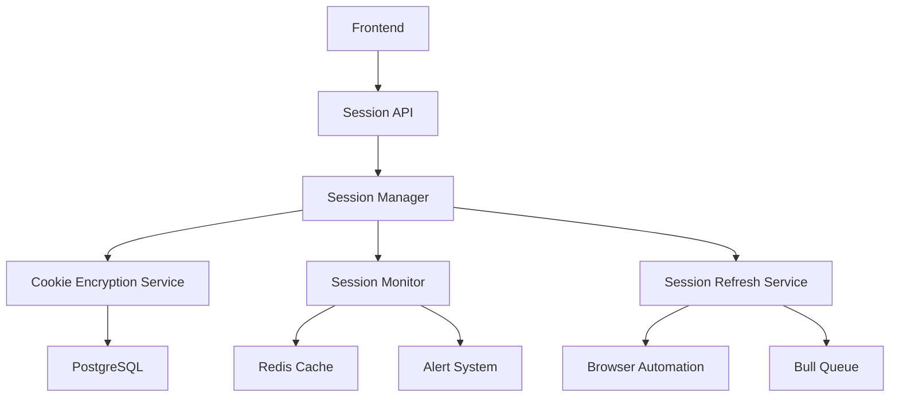

# Design Document: Threads Authentication

## Overview

The Threads Authentication system provides secure, scalable multi-account session management for the Solead platform. It acts as the foundational authentication layer that enables automated agents to interact with Threads on behalf of users. The system manages browser sessions, encrypts sensitive credentials, monitors session health, and automatically refreshes expiring sessions to maintain continuous operation.

## Steering Document Alignment

### Technical Standards (tech.md)
*Note: No steering documents exist yet. Following industry best practices for Node.js/TypeScript applications.*

- **Security First**: AES-256-GCM encryption for all sensitive data
- **Modular Architecture**: Separate concerns into distinct services
- **TypeScript**: Strong typing for all interfaces and data models
- **Async/Await**: Modern async patterns for all I/O operations
- **Dependency Injection**: Loose coupling between components

### Project Structure (structure.md)
*Note: Following standard Node.js project organization.*

```
backend/
├── src/
│   ├── auth/
│   │   ├── SessionManager.ts
│   │   ├── CookieEncryption.ts
│   │   ├── SessionMonitor.ts
│   │   └── SessionRefresh.ts
│   ├── models/
│   │   ├── Account.ts
│   │   └── Session.ts
│   └── utils/
│       ├── encryption.ts
│       └── browserUtils.ts
```

## Code Reuse Analysis

### Existing Components to Leverage
- **Stagehand Browser Automation**: Use for browser control and cookie extraction
- **PostgreSQL Connection Pool**: Reuse database configuration from backend/config/database.ts
- **Redis Cache**: Leverage for session state caching
- **Bull Queue**: Use for scheduling session refresh jobs

### Integration Points
- **Agent System**: Sessions provide authentication for agent operations
- **Database Layer**: Sessions stored in PostgreSQL with encryption
- **Cache Layer**: Redis for quick session validation
- **Queue System**: Bull for background refresh tasks
- **Monitoring**: Prometheus metrics for session health

## Architecture

The authentication system follows a service-oriented architecture with clear separation of concerns:

### Modular Design Principles
- **Single File Responsibility**: Each service handles one domain (encryption, monitoring, refresh)
- **Component Isolation**: Session operations isolated from business logic
- **Service Layer Separation**: Database access through repository pattern
- **Utility Modularity**: Encryption and browser utilities as pure functions



## Components and Interfaces

### SessionManager
- **Purpose:** Central orchestrator for all session operations
- **Interfaces:**
  ```typescript
  interface SessionManager {
    createSession(accountId: string, cookies: Cookie[]): Promise<Session>
    getSession(sessionId: string): Promise<Session | null>
    validateSession(sessionId: string): Promise<boolean>
    refreshSession(sessionId: string): Promise<Session>
    deleteSession(sessionId: string): Promise<void>
    listSessions(accountId: string): Promise<Session[]>
  }
  ```
- **Dependencies:** CookieEncryption, SessionMonitor, SessionRefresh, Database
- **Reuses:** Database connection pool, Redis client

### CookieEncryption
- **Purpose:** Handles encryption/decryption of session cookies
- **Interfaces:**
  ```typescript
  interface CookieEncryption {
    encrypt(cookies: Cookie[], keyId: string): Promise<string>
    decrypt(encryptedData: string, keyId: string): Promise<Cookie[]>
    rotateKey(oldKeyId: string, newKeyId: string): Promise<void>
  }
  ```
- **Dependencies:** AWS KMS or GCP Secret Manager
- **Reuses:** Crypto utilities

### SessionMonitor
- **Purpose:** Continuously monitors session health and validity
- **Interfaces:**
  ```typescript
  interface SessionMonitor {
    checkHealth(sessionId: string): Promise<HealthScore>
    scheduleHealthCheck(sessionId: string): void
    updateHealthScore(sessionId: string, score: number): Promise<void>
    triggerAlert(sessionId: string, reason: string): void
  }
  ```
- **Dependencies:** Redis, Alert system
- **Reuses:** Stagehand for validation checks

### SessionRefresh
- **Purpose:** Automatically refreshes expiring sessions
- **Interfaces:**
  ```typescript
  interface SessionRefresh {
    scheduleRefresh(sessionId: string, ttl: number): void
    performRefresh(sessionId: string): Promise<RefreshResult>
    handleRefreshFailure(sessionId: string, error: Error): Promise<void>
  }
  ```
- **Dependencies:** Bull Queue, Stagehand
- **Reuses:** Browser automation utilities

## Data Models

### Account Model
```typescript
interface Account {
  id: string                    // UUID
  handle: string                 // @username
  displayName: string           // Full name
  status: AccountStatus         // active | expired | suspended
  createdAt: Date
  updatedAt: Date
}

enum AccountStatus {
  ACTIVE = 'active',
  EXPIRED = 'expired',
  SUSPENDED = 'suspended'
}
```

### Session Model
```typescript
interface Session {
  id: string                    // UUID
  accountId: string             // Foreign key to Account
  encryptedCookies: string      // AES-256-GCM encrypted
  encryptionKeyId: string       // KMS key reference
  userAgent: string             // Browser user agent
  viewport: ViewportConfig      // Browser dimensions
  healthScore: number           // 0.0 to 1.0
  failureCount: number          // Consecutive failures
  lastActivityAt: Date          // Last successful use
  expiresAt: Date              // Cookie expiration
  state: SessionState          // State machine status
  createdAt: Date
  updatedAt: Date
}

enum SessionState {
  INIT = 'INIT',
  VALIDATING = 'VALIDATING',
  ACTIVE = 'ACTIVE',
  EXPIRING = 'EXPIRING',
  REFRESHING = 'REFRESHING',
  EXPIRED = 'EXPIRED'
}

interface ViewportConfig {
  width: number
  height: number
  deviceScaleFactor?: number
}
```

### Cookie Model
```typescript
interface Cookie {
  name: string
  value: string
  domain: string
  path: string
  expires?: number
  httpOnly?: boolean
  secure?: boolean
  sameSite?: 'Strict' | 'Lax' | 'None'
}
```

### Health Check Result
```typescript
interface HealthCheckResult {
  sessionId: string
  isValid: boolean
  healthScore: number
  lastCheck: Date
  failureReason?: string
  suggestedAction?: 'refresh' | 'recreate' | 'monitor'
}
```

## Error Handling

### Error Scenarios

1. **Encryption Failure**
   - **Handling:** Log error, reject session creation, alert security team
   - **User Impact:** "Unable to secure session. Please try again or contact support."

2. **Session Validation Failure**
   - **Handling:** Increment failure count, reduce health score, trigger refresh if < 3 failures
   - **User Impact:** No immediate impact, automatic recovery attempted

3. **Refresh Failure (All Attempts)**
   - **Handling:** Mark session expired, disable agents, send notification
   - **User Impact:** "Session expired. Please log in again to continue."

4. **Database Connection Loss**
   - **Handling:** Serve from Redis cache, queue writes, circuit breaker pattern
   - **User Impact:** Degraded mode message, read-only operations available

5. **KMS Key Rotation Failure**
   - **Handling:** Rollback to previous key, alert security team, retry with backoff
   - **User Impact:** No impact if rollback succeeds

6. **Rate Limiting by Threads**
   - **Handling:** Exponential backoff, distribute requests across sessions
   - **User Impact:** "Temporary slowdown in lead discovery"

## API Endpoints

### REST API Design
```typescript
// Session Management
POST   /api/v1/sessions                    // Create new session
GET    /api/v1/sessions                    // List all sessions
GET    /api/v1/sessions/:id                // Get session details
POST   /api/v1/sessions/:id/refresh        // Manual refresh
DELETE /api/v1/sessions/:id                // Delete session
GET    /api/v1/sessions/:id/health         // Health status

// Account Management
POST   /api/v1/accounts                    // Add account
GET    /api/v1/accounts                    // List accounts
GET    /api/v1/accounts/:id                // Account details
PUT    /api/v1/accounts/:id                // Update account
DELETE /api/v1/accounts/:id                // Remove account
GET    /api/v1/accounts/:id/sessions       // Account's sessions
```

## Security Considerations

### Encryption Strategy
- **At Rest:** AES-256-GCM for cookies in database
- **In Transit:** TLS 1.3 for all API calls
- **Key Management:** AWS KMS with automatic rotation
- **Memory:** Decrypted cookies only in memory, cleared after use

### Access Control
- **Authentication:** JWT tokens for API access
- **Authorization:** Role-based access control (RBAC)
- **Audit:** All session operations logged
- **Rate Limiting:** Per-user and global limits

## Testing Strategy

### Unit Testing
- **Encryption Service:** Test encrypt/decrypt with various inputs
- **Session State Machine:** Verify all state transitions
- **Health Scoring:** Test calculation logic
- **Refresh Logic:** Mock browser interactions

### Integration Testing
- **Database Operations:** Test CRUD with real PostgreSQL
- **Cache Operations:** Test Redis integration
- **Queue Processing:** Test Bull job handling
- **KMS Integration:** Test with test keys

### End-to-End Testing
- **Session Creation Flow:** From browser to database
- **Auto-Refresh Flow:** Trigger and verify refresh
- **Health Monitoring:** Simulate failures and recovery
- **Multi-Account:** Test concurrent session management

### Performance Testing
- **Load Testing:** 100+ concurrent sessions
- **Encryption Performance:** < 100ms for cookie operations
- **Database Queries:** < 50ms for session lookups
- **Cache Hit Rate:** > 90% for active sessions